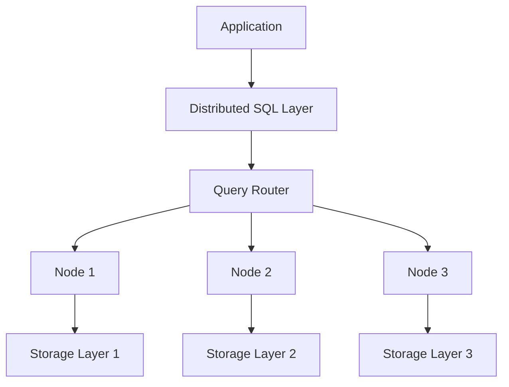

# 🔄 NewSQL: Horizontal Scaling - Technical Documentation

## 1. Overview and Problem Statement 🎯

NewSQL represents a modern approach to database management that combines the ACID guarantees of traditional relational databases with the horizontal scalability of NoSQL systems. This documentation explores how NewSQL enables horizontal scaling while maintaining strong consistency and relational capabilities.

Traditional relational databases excel at consistency and transactions but struggle with horizontal scaling. NoSQL databases solved the scaling problem but sacrificed ACID properties. NewSQL emerged to bridge this gap, offering the best of both worlds.

The business impact of NewSQL horizontal scaling includes:
- Improved performance for high-throughput OLTP workloads
- Reduced infrastructure costs through efficient resource utilization
- Better availability and fault tolerance
- Maintained data consistency for critical business operations

## 2. Detailed Solution/Architecture 🏗️

NewSQL achieves horizontal scaling through several key architectural components:

### Distributed Query Processing
NewSQL systems distribute query execution across multiple nodes while maintaining transaction guarantees. This involves:

1. Query Planning: Breaking complex queries into distributable components
2. Data Sharding: Intelligent distribution of data across nodes
3. Consensus Protocols: Ensuring consistency across distributed operations

### Shared-Nothing Architecture
Each node operates independently with its own CPU, memory, and storage. This eliminates bottlenecks and enables linear scalability.

Here's how the components work together:



## 3. Technical Implementation 💻

### Sharding Implementation

The following example demonstrates how to implement sharding in a NewSQL environment:

```python
from newsql_db import Cluster, ShardingStrategy

def configure_sharding(cluster: Cluster):
    """
    Purpose: Configure horizontal sharding for a NewSQL cluster
    Problem: Distribute data across multiple nodes while maintaining consistency
    Dependencies: newsql_db library
    Outcome: Horizontally scaled database cluster
    """
    # Define sharding strategy
    strategy = ShardingStrategy(
        shard_key="customer_id",
        shard_function="hash",
        number_of_shards=8
    )
    
    # Apply sharding configuration
    cluster.set_sharding_strategy(strategy)
    
    # Configure replication for fault tolerance
    cluster.set_replication_factor(3)
    
    return cluster

def execute_distributed_query(cluster: Cluster, customer_id: int):
    """
    Execute a query across sharded data
    """
    # Query router automatically handles distribution
    result = cluster.execute_query("""
        SELECT * FROM transactions 
        WHERE customer_id = ?
    """, [customer_id])
    
    return result
```

### Consensus Protocol Implementation

Here's an example of implementing a consensus protocol for distributed transactions:

```java
public class DistributedTransaction {
    /**
     * Purpose: Implement two-phase commit for distributed transactions
     * Problem: Maintain ACID properties across shards
     * Dependencies: TransactionManager, ShardManager
     * Outcome: Consistent distributed transaction
     */
    private final TransactionManager txManager;
    private final List<Shard> participants;
    
    public boolean executeTransaction(Query query) {
        // Phase 1: Prepare
        boolean allPrepared = participants.stream()
            .allMatch(shard -> shard.prepare(query));
            
        if (!allPrepared) {
            participants.forEach(Shard::rollback);
            return false;
        }
        
        // Phase 2: Commit
        participants.forEach(Shard::commit);
        return true;
    }
}
```

## 4. Decision Criteria & Evaluation 📊

### When to Choose NewSQL

Consider NewSQL for horizontal scaling when:
- High transaction throughput is required
- Strong consistency guarantees are necessary
- Complex queries and joins are common
- Horizontal scalability is essential

Comparison with alternatives:

| Feature | Traditional SQL | NoSQL | NewSQL |
|---------|----------------|--------|---------|
| Horizontal Scaling | Limited | Excellent | Excellent |
| ACID Compliance | Full | Limited/None | Full |
| Query Flexibility | High | Limited | High |
| Implementation Complexity | Low | Medium | High |

## 5. Performance Metrics & Optimization ⚡

### Key Performance Indicators

Monitor these metrics for optimal performance:
- Transactions per second (TPS)
- Query latency across shards
- Replication lag
- Consensus round-trip time

Here's an example of implementing performance monitoring:

```python
def monitor_cluster_performance(cluster: Cluster):
    """
    Purpose: Monitor key performance metrics
    Problem: Track cluster health and performance
    Dependencies: monitoring_lib
    Outcome: Performance metrics dashboard
    """
    metrics = {
        'tps': cluster.get_transaction_rate(),
        'latency': cluster.get_average_latency(),
        'replication_lag': cluster.get_replication_lag(),
        'consensus_rtt': cluster.get_consensus_rtt()
    }
    
    # Alert if thresholds exceeded
    for metric, value in metrics.items():
        if value > THRESHOLDS[metric]:
            alert_operations_team(metric, value)
            
    return metrics
```

## 8. Anti-Patterns ⚠️

### Common Mistakes

1. Inappropriate Shard Key Selection
   Incorrect:
```sql
-- Using a non-uniform distribution key
SHARD BY timestamp
```

Correct:
```sql
-- Using a key with uniform distribution
SHARD BY HASH(customer_id)
```

2. Ignoring Network Latency
   Incorrect:
```python
def process_transaction(cluster):
    # Don't perform multiple round-trips
    for item in items:
        cluster.execute_query(item)  # N network round-trips
```

Correct:
```python
def process_transaction(cluster):
    # Batch operations to reduce network overhead
    cluster.execute_batch(items)  # Single network round-trip
```

## 11. Troubleshooting Guide 🔧

### Common Issues and Solutions

1. Split-Brain Scenario
   Problem: Network partition causes nodes to operate independently
   Solution:

```python
def handle_network_partition(cluster: Cluster):
    """
    Purpose: Detect and resolve split-brain scenarios
    Problem: Network partitions causing inconsistent states
    Dependencies: cluster_health_lib
    Outcome: Restored cluster consistency
    """
    if cluster.detect_partition():
        # Isolate minority partition
        minority_nodes = cluster.get_minority_partition()
        minority_nodes.pause_operations()
        
        # Restore connectivity
        cluster.rebuild_connections()
        
        # Reconcile states
        cluster.sync_states()
```

## 13. Real-world Use Cases 🌐

### Financial Services Implementation

A major financial institution implemented NewSQL horizontal scaling to handle:
- 1 million transactions per second
- Sub-millisecond latency requirements
- Zero downtime requirement
- Global distribution requirements

Implementation approach:
1. Geographic sharding by region
2. Local replicas for read operations
3. Global consensus for write operations
4. Real-time monitoring and failover

## 14. References and Additional Resources 📚

### Technical Documentation
- "Principles of Distributed Database Systems" - M. Tamer Özsu
- "NewSQL and NoSQL for Big Data Analytics" - Peter Lake

### Research Papers
- "Calvin: Fast Distributed Transactions for Partitioned Database Systems"
- "Spanner: Google's Globally-Distributed Database"

### Community Resources
- NewSQL Database Comparison Working Group
- Distributed Systems Weekly Newsletter