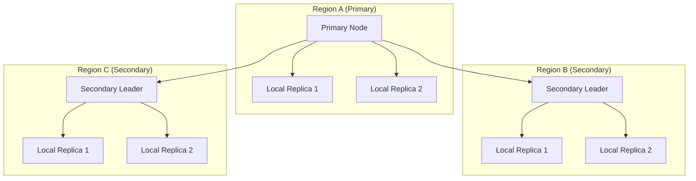
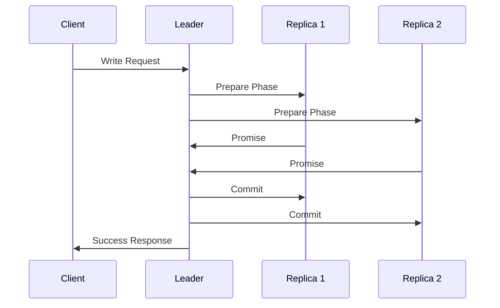

# 🔄 NewSQL: Replication - Technical Documentation

## 1. Overview and Problem Statement 🎯

Database replication in NewSQL systems represents a fundamental advancement in how we maintain data consistency and availability across distributed systems. Unlike traditional replication methods, NewSQL replication combines the strong consistency guarantees of classical databases with modern distributed system principles.

Traditional database replication often forced architects to choose between consistency and availability. NewSQL replication resolves this tension by implementing sophisticated consensus protocols and intelligent replica management strategies. This allows organizations to maintain multiple synchronized copies of their data while ensuring that all nodes see the same version of truth at any given moment.

The business value of NewSQL replication manifests in several critical ways:
- Ensures continuous business operations even during node failures
- Provides local data access for globally distributed applications
- Maintains data consistency for financial and mission-critical transactions
- Enables read scaling without compromising write consistency
- Reduces latency by serving requests from geographically closer nodes

## 2. Detailed Solution/Architecture 🏗️

NewSQL replication architecture builds upon proven distributed systems principles while introducing novel approaches to handle modern scale and consistency requirements. Let's explore the core mechanisms that make this possible.

### Replication Topology

NewSQL systems typically implement a sophisticated multi-region replication topology that enables both local and global consistency guarantees. Here's a visual representation of a typical setup:



### Consensus Protocol

At the heart of NewSQL replication lies a consensus protocol that ensures all replicas agree on the sequence of transactions. Here's how a typical consensus round works:



## 3. Technical Implementation 💻

Let's explore how to implement NewSQL replication in practice. We'll start with the core replication manager:

```java
/**
 * ReplicationManager handles the coordination of data replication across nodes.
 * It implements a multi-phase consensus protocol to ensure consistency.
 */
public class ReplicationManager {
    private final List<ReplicaNode> replicas;
    private final ConsensusProtocol consensus;
    private final TransactionLog txLog;
    
    /**
     * Initiates a write operation across all replicas using a two-phase commit protocol.
     * This ensures that either all nodes commit the transaction or none do.
     */
    public TransactionResult replicateWrite(Transaction tx) {
        // Phase 1: Prepare - All replicas must acknowledge
        PrepareResult prepareResult = consensus.prepare(tx, replicas);
        
        if (!prepareResult.isAllPrepared()) {
            rollbackTransaction(tx);
            throw new ReplicationException("Failed to prepare all replicas");
        }
        
        // Phase 2: Commit - Persist the transaction across all replicas
        CommitResult commitResult = consensus.commit(tx, replicas);
        
        // Log the transaction outcome for recovery purposes
        txLog.record(tx, commitResult);
        
        return new TransactionResult(commitResult.isSuccessful());
    }
    
    /**
     * Handles the case where a replica becomes unavailable during replication.
     * Implements automatic failover when necessary.
     */
    private void handleReplicaFailure(ReplicaNode failedNode) {
        // Remove failed node from active set
        replicas.remove(failedNode);
        
        // Initiate recovery protocol
        RecoveryProtocol recovery = new RecoveryProtocol(txLog);
        recovery.synchronizeReplica(failedNode);
        
        // Add back to replica set once synchronized
        if (recovery.isSuccessful()) {
            replicas.add(failedNode);
        }
    }
}
```

### Implementing Read Replicas

Here's how to implement read replica management:

```python
class ReadReplicaManager:
    """
    Manages read replicas and ensures they maintain an acceptable level of
    synchronization with the primary node.
    """
    def __init__(self, primary_node, replicas, max_lag_ms=100):
        self.primary = primary_node
        self.replicas = replicas
        self.max_lag_ms = max_lag_ms
        
    def get_suitable_replica(self, consistency_level):
        """
        Returns an appropriate replica based on the requested consistency level
        and current replication lag.
        """
        if consistency_level == ConsistencyLevel.STRONG:
            # Only return replicas that are fully caught up
            return self._get_synchronized_replica()
        elif consistency_level == ConsistencyLevel.EVENTUAL:
            # Return any replica within acceptable lag threshold
            return self._get_available_replica()
            
    def _get_synchronized_replica(self):
        """
        Returns a replica that is fully synchronized with the primary.
        Implements synchronous replication check.
        """
        for replica in self.replicas:
            lag = self._calculate_replication_lag(replica)
            if lag < self.max_lag_ms:
                return replica
        
        # Fallback to primary if no suitable replica found
        return self.primary
```

## 4. Decision Criteria & Evaluation 📊

When implementing NewSQL replication, several key decisions need to be made based on your specific requirements:

### Synchronous vs. Asynchronous Replication

Consider these factors when choosing your replication mode:

| Factor | Synchronous | Asynchronous |
|--------|-------------|--------------|
| Consistency | Stronger | Eventual |
| Latency | Higher | Lower |
| Failover Recovery | Immediate | Potential data loss |
| Network Requirements | More demanding | More flexible |
| Geographic Distribution | Limited by latency | Global scale |

## 5. Performance Metrics & Optimization ⚡

To maintain optimal replication performance, monitor these key metrics:

```python
class ReplicationMonitor:
    """
    Monitors and reports on critical replication metrics.
    Helps identify performance issues and replication lag.
    """
    def collect_metrics(self):
        metrics = {
            'replication_lag': self._measure_replication_lag(),
            'consensus_latency': self._measure_consensus_latency(),
            'replica_health': self._check_replica_health(),
            'transaction_throughput': self._measure_throughput()
        }
        
        if metrics['replication_lag'] > self.max_acceptable_lag:
            self._trigger_lag_alert(metrics)
            
        return metrics
        
    def _measure_replication_lag(self):
        """
        Calculates the current replication lag across all replicas.
        Returns the maximum observed lag in milliseconds.
        """
        max_lag = 0
        for replica in self.replicas:
            lag = self.primary.last_commit_time - replica.last_commit_time
            max_lag = max(max_lag, lag)
        return max_lag
```

## 8. Anti-Patterns ⚠️

Let's examine common replication anti-patterns and their solutions:

### Split-Brain Syndrome

Incorrect approach (dangerous):
```java
// DON'T DO THIS: Naive handling of network partitions
public void handleNetworkPartition() {
    if (!canReachPrimary()) {
        // Dangerous: Could create split-brain scenario
        promoteToPrimary(this);
    }
}
```

Correct approach:
```java
public void handleNetworkPartition() {
    // Use quorum-based decision making
    int totalNodes = cluster.getTotalNodes();
    int reachableNodes = cluster.getReachableNodes();
    
    if (reachableNodes > totalNodes / 2) {
        // We have quorum - safe to proceed
        consensusProtocol.electNewLeader();
    } else {
        // Enter read-only mode until quorum is restored
        enterReadOnlyMode();
    }
}
```

## 11. Troubleshooting Guide 🔧

When replication issues occur, follow this systematic approach:

```python
class ReplicationTroubleshooter:
    """
    Provides systematic approaches to diagnose and resolve
    common replication issues.
    """
    def diagnose_replication_issue(self):
        # Check network connectivity first
        if not self._verify_network_connectivity():
            return "Network connectivity issues detected"
            
        # Verify consensus protocol health
        if not self._verify_consensus_health():
            return "Consensus protocol problems detected"
            
        # Check for data corruption
        if not self._verify_data_integrity():
            return "Data corruption detected"
            
        # Examine replication lag
        lag = self._measure_replication_lag()
        if lag > self.threshold:
            return f"Excessive replication lag: {lag}ms"
```

## 13. Real-world Use Cases 🌐

### Global Financial Trading Platform

A major investment bank implemented NewSQL replication to handle their global trading platform:

Implementation Details:
- 5 geographic regions
- Sub-millisecond replication within regions
- Under 10ms replication between regions
- Automatic failover capability
- Zero data loss guarantee

Technical Solution:
```python
class GlobalTradingReplication:
    """
    Implements multi-region replication for a global trading platform.
    Ensures consistent order execution across all regions.
    """
    def process_trade(self, trade):
        # Ensure local region commitment
        local_result = self.local_region.commit(trade)
        
        # Synchronously replicate to nearest region
        near_region_result = self.sync_replicate(
            trade, 
            self.nearest_region
        )
        
        # Asynchronously replicate to distant regions
        self.async_replicate(trade, self.distant_regions)
        
        return local_result and near_region_result
```

## 14. References and Additional Resources 📚

Essential reading for deep understanding:
- "Designing Data-Intensive Applications" by Martin Kleppmann
- "Distributed Systems: Principles and Paradigms" by Andrew S. Tanenbaum
- "The NewSQL Database Papers" - Readings in Database Systems
- "Consensus: Bridging Theory and Practice" by Diego Ongaro

Research Papers:
- "Calvin: Fast Distributed Transactions for Partitioned Database Systems"
- "Spanner: Google's Globally-Distributed Database"
- "CockroachDB: The Resilient Geo-Distributed SQL Database"